## Jansen & Rit (1995) — Replication {.smaller}

Replication of all simulation experiments from:

> Jansen, B. H. & Rit, V. G. (1995). *Electroencephalogram and visual evoked potential generation in a mathematical model of coupled cortical columns.* Biological Cybernetics, 73, 357–366.

Using `tvbo` with the `tvboptim` backend, driven entirely by a declarative YAML specification.

## Fig. 3 — C sweep (Exp. 1) {.smaller}

::::: {.columns}

:::: {.column width="30%"}
**Original**

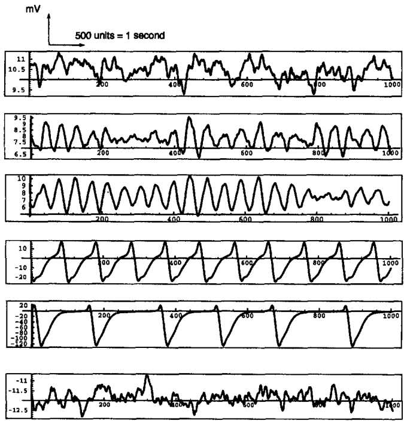
::::

:::: {.column width="40%"}
**Specification**

```yaml
id: 1
label: "Single-column spontaneous activity:
        C sweep (Fig. 3)"
dynamics: JansenRit1995
  # A=3.25, B=22, v0=6
integration:
  method: RungeKutta4thOrder
  duration: 2.0 s
  step_size: 0.002 s
  transient_time: 0.5 s
explorations:
  C_sweep_fig3:
    parameters:
      C:
        explored_values:
          [68, 128, 135, 270, 675, 1350]
```
::::

:::: {.column width="30%"}
**Reproduced**

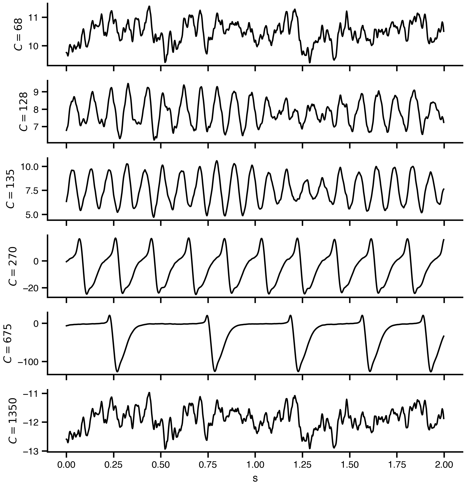
::::

:::::


## Fig. 4 — 4D parameter space (Exp. 2) {.smaller}

::::: {.columns}

:::: {.column width="30%"}
**Original**

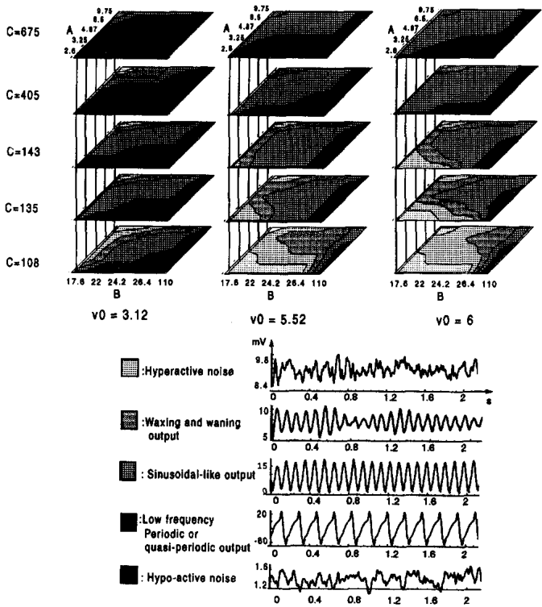
::::

:::: {.column width="40%"}
**Specification**

```yaml
id: 2
label: "4D parameter space exploration
        (Fig. 4)"
dynamics: *base_dynamics  # JansenRit1995
integration: *integration_2s
explorations:
  param_space_4D_fig4:
    mode: product
    parameters:
      A:
        domain: {lo: 2.6, hi: 9.75, n: 50}
        unit: mV
      B:
        domain: {lo: 17.6, hi: 110, n: 50}
        unit: mV
      C:
        explored_values:
          [108, 135, 143, 405, 675]
      v0:
        explored_values: [3.12, 5.52, 6.0]
        unit: mV
```
::::

:::: {.column width="30%"}
**Reproduced**

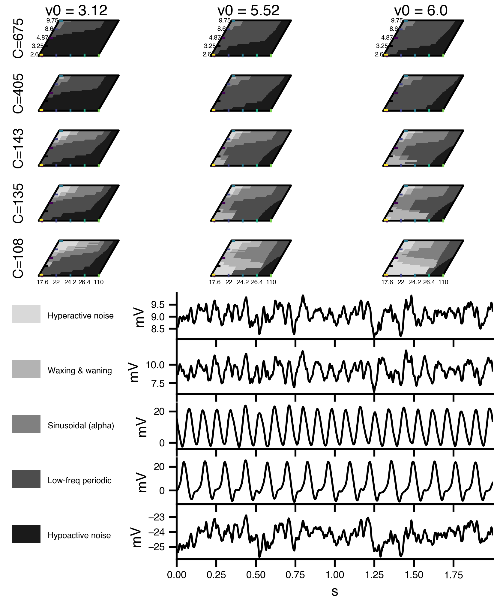
::::

:::::


## Fig. 5 — Symmetric K sweep (Exp. 3) {.smaller}

::::: {.columns}

:::: {.column width="30%"}
**Original**

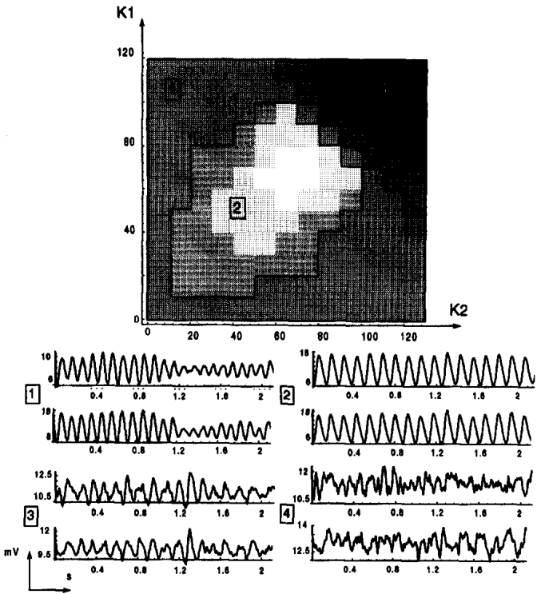
::::

:::: {.column width="40%"}
**Specification**

```yaml
id: 3
label: "Double column (identical), zero delay:
        K1×K2 sweep (Fig. 5)"
dynamics: *base_dynamics
network:
  nodes: 2  # identical (visual cortex)
  coupling: sigmoidal, zero delay
  edges: bidirectional symmetric
integration: *integration_2s
explorations:
  K_sweep_symmetric_fig5:
    mode: product
    parameters:
      K:
        domain: {lo: 0, hi: 120, step: 10}
```
::::

:::: {.column width="30%"}
**Reproduced**

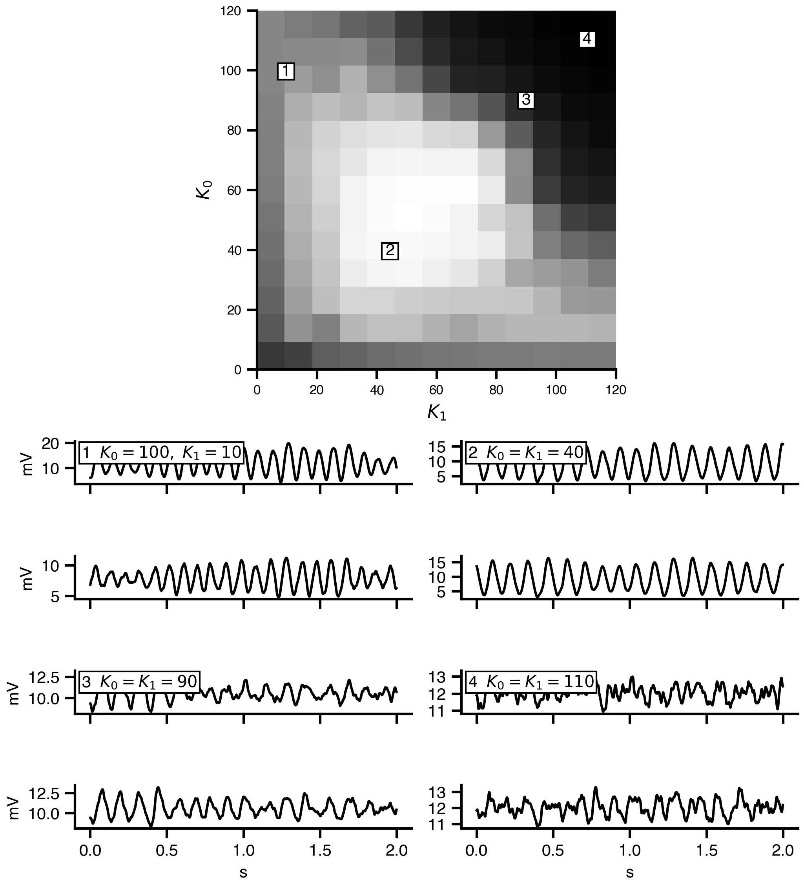
::::

:::::


## Fig. 6 — Asymmetric K sweep (Exp. 4) {.smaller}

::::: {.columns}

:::: {.column width="30%"}
**Original**

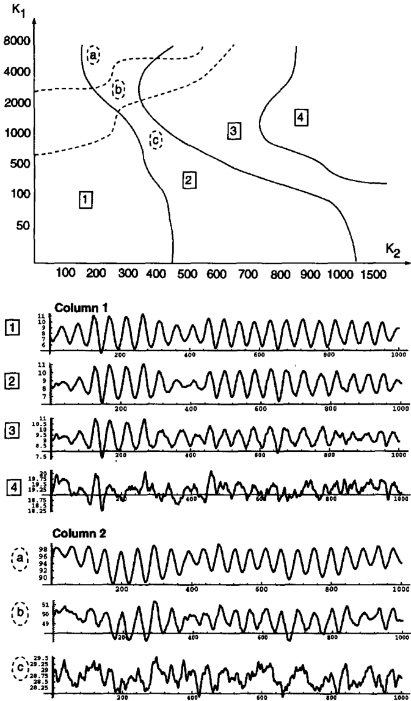
::::

:::: {.column width="40%"}
**Specification**

```yaml
id: 4
label: "Double column (different), delayed:
        K1×K2 sweep (Fig. 6)"
dynamics: JansenRit1995_Delayed
  # 8 state vars: y0–y5 + z0, z1
network:
  nodes: 2  # visual (alpha) + prefrontal (beta)
  coupling: sigmoidal + delayed EPSP (a_d=30)
  edges: directed, K1 >> K2
integration: *integration_2s
explorations:
  K_sweep_asymmetric_fig6:
    mode: product
    parameters:
      K[0]:  # K2 (prefrontal→visual)
        domain: {lo: 0, hi: 1500, n: 100}
      K[1]:  # K1 (visual→prefrontal)
        domain: {lo: 0, hi: 8000, n: 100}
```
::::

:::: {.column width="30%"}
**Reproduced**

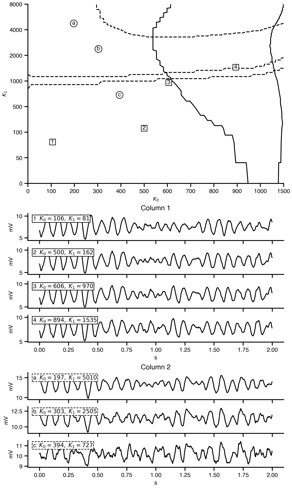
::::

:::::


## Fig. 8 — VEP symmetric, averaged (Exp. 5a) {.smaller}

::::: {.columns}

:::: {.column width="30%"}
**Original**

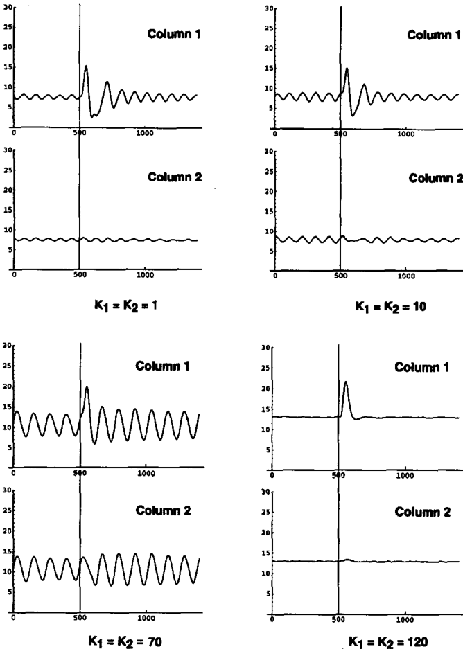
::::

:::: {.column width="40%"}
**Specification**

```yaml
id: 5
label: "VEP: identical columns, no delay
        (Figs. 8-10)"
dynamics: JansenRit1995_VEP
  # y4 += P stimulus term
network:
  nodes: 2 identical, zero delay
events:
  P:  # flash stimulus
    equation: q·(t/w)^n·exp(-t/w)
    n: 7, w: 0.005, q: 0.5
    onset: 1.0 s, column 1 only
integration:
  duration: 3.0 s, transient: 6.0 s
explorations:
  VEP_symmetric_K_fig8:
    mode: zip
    n_trials: 20, average: trials
    K: [1, 10, 70, 120]
```
::::

:::: {.column width="30%"}
**Reproduced**

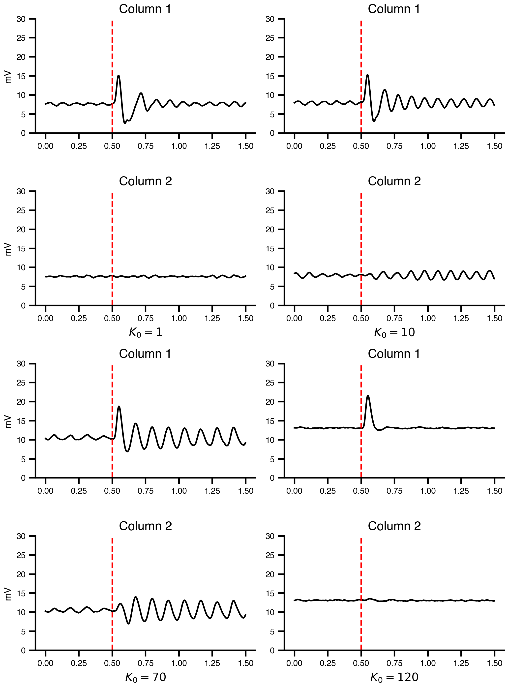
::::

:::::


## Fig. 9 — VEP asymmetric, averaged (Exp. 5b) {.smaller}

::::: {.columns}

:::: {.column width="30%"}
**Original**

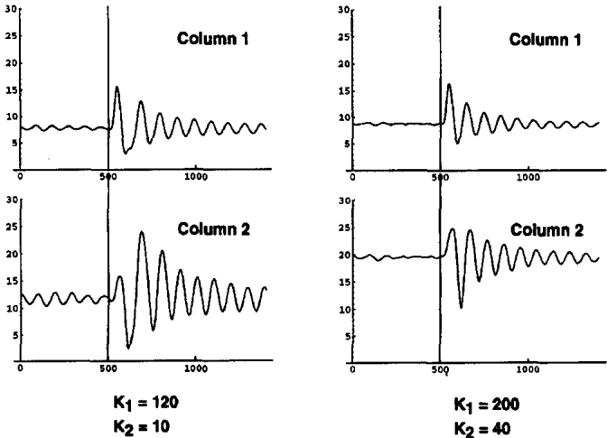
::::

:::: {.column width="40%"}
**Specification**

```yaml
explorations:
  VEP_asymmetric_K_fig9:
    mode: zip
    n_trials: 20
    average: trials
    parameters:
      K[0]:  # K2
        explored_values: [10, 40]
      K[1]:  # K1
        explored_values: [120, 200]
```
::::

:::: {.column width="30%"}
**Reproduced**

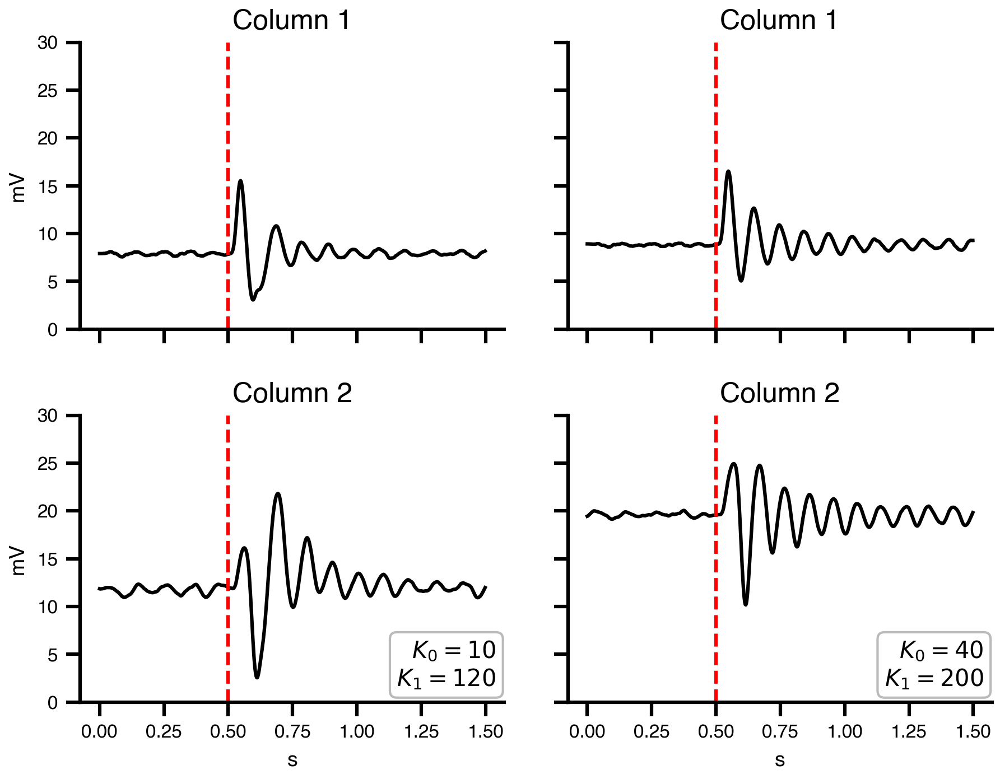
::::

:::::


## Fig. 10 — VEP single trials (Exp. 5c) {.smaller}

::::: {.columns}

:::: {.column width="30%"}
**Original**

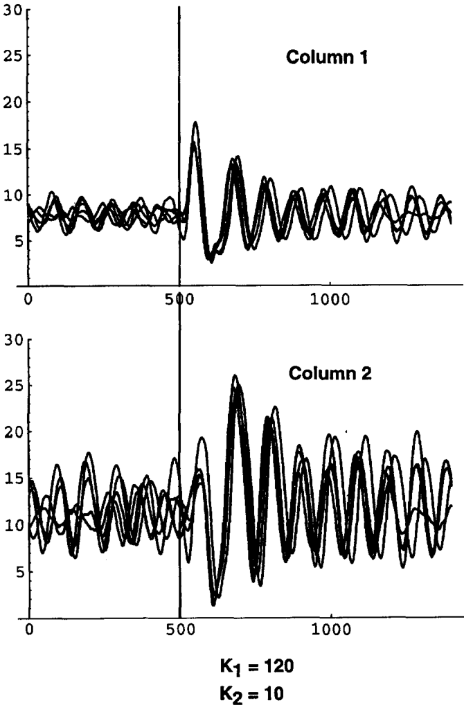
::::

:::: {.column width="40%"}
**Specification**

```yaml
explorations:
  VEP_single_trials_fig10:
    mode: zip
    n_trials: 5
    # no averaging — show individual trials
    parameters:
      K[0]:  # K2
        explored_values: [10]
      K[1]:  # K1
        explored_values: [120]
```
::::

:::: {.column width="30%"}
**Reproduced**

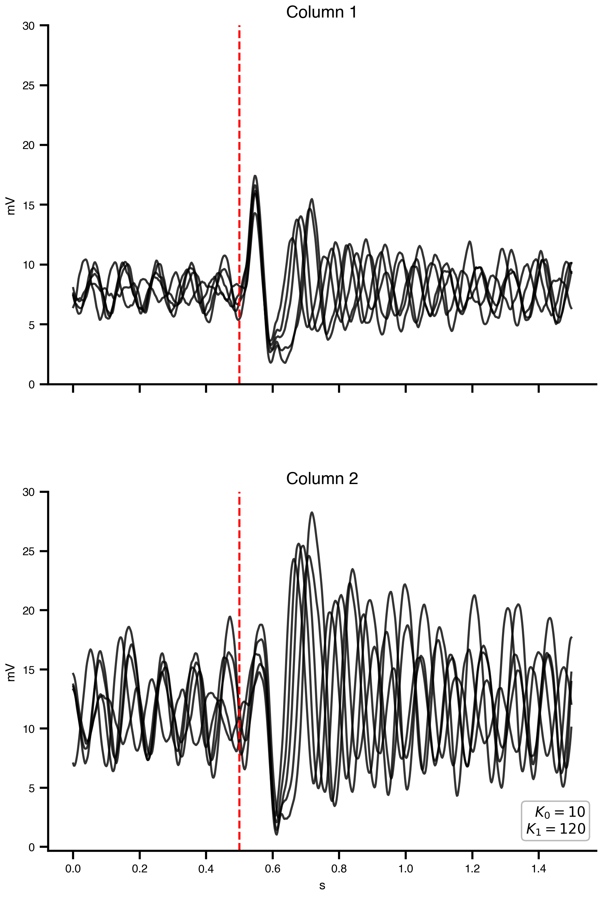
::::

:::::


## Fig. 11 — VEP delayed columns (Exp. 6) {.smaller}

::::: {.columns}

:::: {.column width="30%"}
**Original**


::::

:::: {.column width="40%"}
**Specification**

```yaml
id: 6
label: "VEP: different columns, with delay
        (Fig. 11)"
dynamics: JansenRit1995_Delayed_VEP
  # 8 state vars + P stimulus
network:
  nodes: 2 different
    # visual (alpha) + prefrontal (beta)
  coupling: sigmoidal + delayed EPSP
  edges: directed, asymmetric
integration:
  duration: 3.0 s, transient: 6.0 s
explorations:
  VEP_delayed_fig11:
    mode: zip
    n_trials: 40
    average: trials
    parameters:
      K[0]:  # K2
        explored_values: [300, 100]
      K[1]:  # K1
        explored_values: [1000, 4000]
```
::::

:::: {.column width="30%"}
**Reproduced**

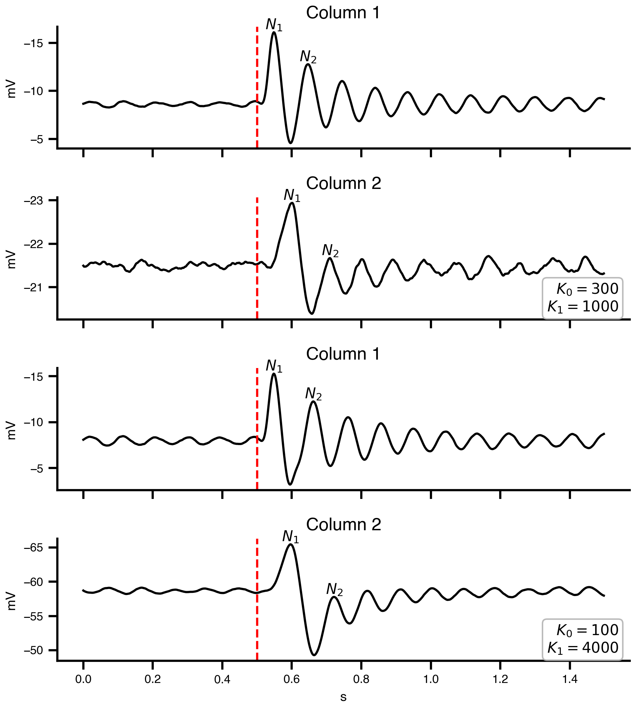
::::

:::::
