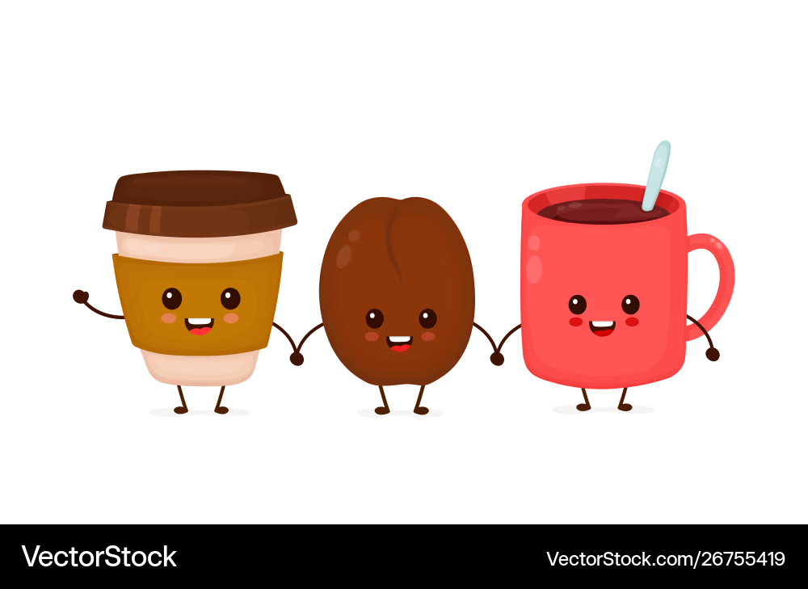

## Classic TVB - What is it?

::: {.incremental}
* Lets you define a networked system stochastic delay differential equations (SDDEs)
* Includes timeseries transformations (eg. Bold Monitor)
* Curates some models
* GUI 🥲 
:::

## Classic TVB - History

::: {.incremental}
* Python code base - first commit on GitHib 12th Feb 2015 - in that time:
  - Python 2.7 was still the standard
  - Python packaging was still a mess (pip only just got bundled with python + setup.py)
  - Machine Learning meant gradient boosted trees & CNNs for vision
:::

::: {.fragment}
$\rightarrow$ Can we use better tools to do the Job?
:::

## Brain Simulation 3.0

::: {.fragment}
Goals:
:::

::: {.incremental}
* Reproducibility
* Fast & Scalable
* Differentiable
* Easy to use
* Customizable + Interoparability with own workflow
:::

::: {.fragment}
Tools:
:::

::: {.incremental}
* TVB-O [](https://pypi.org/project/tvbo/)
* TVB-Optim [](https://pypi.org/project/tvboptim/)
:::


## Specify Reproducible Simulation Experiments with:


![Knowledge Management for Digital Brain Twins [@Martin2025]](figures/tvbo_logo.png){width=10px}





## Run and Optimize models with:

![A JAX-based framework for brain network simulation and gradient-based optimization [@Pille2025].](figures/tvboptim.png)



## Biological Mechanistic Model-Discovery

::: {style="font-size: 0.8em;"}
* Learning the dynamics of biological pathways
* Replace unknown terms in equations with neural networks — learn biology, not just fits
* TVB-O provides the mechanistic scaffold; TVB-Optim supplies the gradients to train it
* Discovered components stay interpretable: constrained by network structure & known dynamics
:::

{fig-align="center"}

## Hands-On

:::{.r-fit-text}
**wiki.ebrains.eu/bin/view/Collabs/brainsimulation-3-0/Lab**
:::

```{python}
#| echo: false
#| fig-align: center
import qrcode
from qrcode.image.styledpil import StyledPilImage
from qrcode.image.styles.moduledrawers import RoundedModuleDrawer
from IPython.display import display

url = "https://git.bihealth.org/tvbo/tvb-o-ptim/-/blob/main/README.md?ref_type=heads"
qr = qrcode.QRCode(error_correction=qrcode.constants.ERROR_CORRECT_H, box_size=20, border=2)
qr.add_data(url)
qr.make(fit=True)
img = qr.make_image(image_factory=StyledPilImage, module_drawer=RoundedModuleDrawer())#, embeded_image_path="../favicon.png")
display(img)
```

:::{.r-fit-text}
**or: https://github.com/mapi1/brainsimulation-3.0
**
:::

## Thank You

::: {.r-stretch}

:::

## Have a nice Weekend!

And thanks for the new coffee machine :)

{fig-align="center"}


## References
