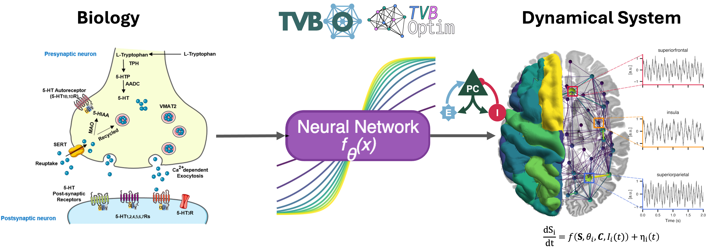

## Classic TVB - What is it?

::: {.incremental}
* Lets you define a networked system stochastic delay differential equations (SDDEs)
* Includes timeseries transformations (eg. Bold Monitor)
* Curates some models
:::

## Classic TVB - History

::: {.incremental}
* Python code base - first commit on GitHib 12th Feb 2015 - in that time:
  - Python 2.7 was still the standard
  - Python packaging was still a mess (pip only just got bundled with python + setup.py)
  - Machine Learning meant gradient boosted trees & CNNs for vision
:::

::: {.fragment}
$\rightarrow$ Can we use better tools to do the Job?
:::

## Brain Simulation 3.0

Goals:

::: {.incremental}
* Reproducibility
* Fast & Scalable
* Differentiable
* Easy to use
* Customizable + Interoparability with own workflow
:::

<!--
## Classic TVB - Math

:::: {.columns}

::: {.column}
::: {.fragment fragment-index=0}
$$
dS_i = \left[f_d(S_i, \theta^d, C_i, I_i) \right]dt + g(S_i, \theta^g)\, dW_i
$$

::: {style="font-size: 0.55em;"}

**State Evolution**

- $S_i$ - state variables at node $i$
- $f_d$ - dynamics function with parameters $\theta^d$
- $C_i$ - coupling input from connected nodes
- $I_i$ - external input (stimulation, driving signals)
- $g$ - noise diffusion coefficient with parameters $\theta^g$
- $dW_i$ - Wiener process (stochastic fluctuations)
:::

:::

:::

::: {.column}

::: {.fragment fragment-index=2}
$$
C_i = f_c^{\text{post}}\Big(\sum_j A_{ij}\, f_c^{\text{pre}}(S_i, S_j(t-\tau_{ij}), \theta^c), S_i, \theta^c\Big)
$$

::: {style="font-size: 0.55em;"}
**Coupling**

- $f_c^{\text{pre}}$ - pre-aggregation transformation
- $A_{ij}$ - structural connectivity weight ($j \to i$)
- $\tau_{ij}$ - transmission delay (tract length / conduction speed)
- $f_c^{\text{post}}$ - post-aggregation transformation
- $\theta^c$ - coupling parameters
:::

:::
:::

::::
 -->

## Specify Reproducible Simulation Experiments with:

![Knowledge Management for Digital Brain Twins [@Martin2025]](figures/tvbo_logo.png){width=10px}



## Run and Optimize models with:

![A JAX-based framework for brain network simulation and gradient-based optimization [@Pille2025].](figures/tvboptim.png)



## Biological Mechanistic Model-Discovery

## Hands-On

:::{.r-fit-text}
**wiki.ebrains.eu/bin/view/Collabs/brainsimulation-3-0/Lab**
:::

{fig-align="center"}

## Thank You

::: {.r-stretch}

:::

## References